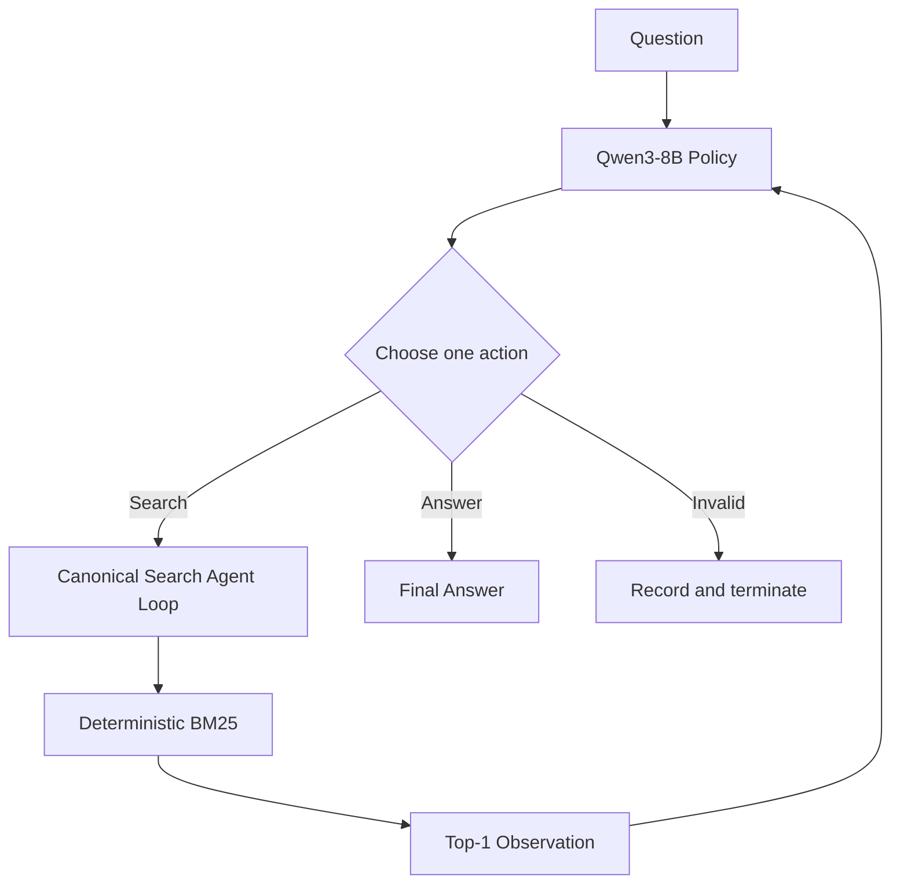

<p align="center"></p>

<h1 align="center">SearchAgent-RL</h1>

<h3 align="center">Reinforcement Learning for Multi-turn Search Agents</h3>

<p align="center">Train Qwen3-8B to decide <b>what to search, whether to search again, and when to answer</b> through multi-turn interaction.</p>

<p align="center">Qwen3-8B · GRPO · verl · vLLM · FSDP · Ray · HotpotQA</p>

<picture><source media="(prefers-color-scheme: dark)" srcset="assets/hero-dark.svg"><source media="(prefers-color-scheme: light)" srcset="assets/hero-light.svg"></picture>

**SearchAgent-RL** is a reproducible Agentic RL project for training search agents in a controlled multi-hop retrieval environment.

Instead of evaluating only final-answer accuracy, the project also tracks how RL changes the agent's **search depth, retrieval quality, stopping behavior, and protocol reliability**.

## Results at a Glance

Evaluation on 200 Natural Bridge-Hard examples:

| Metric | Qwen3-8B Base | Vanilla GRPO |
|---|---:|---:|
| EM ↑ | 32.5% | **51.5%** |
| F1 ↑ | 42.03% | **62.53%** |
| Multi-search ↑ | 31.5% | **86.0%** |
| Invalid Action ↓ | 10.06% | **0.17%** |

**GRPO improves more than answer accuracy.** The trained policy performs substantially more multi-step retrieval while almost eliminating invalid actions.

---

## Task Setting & Motivation

### Why Multi-turn Search?

Many multi-hop questions cannot be solved by retrieving a single passage. A typical bridge question follows:

```text
Question
   ↓
Search #1
   ↓
Intermediate entity
   ↓
Search #2 conditioned on that entity
   ↓
Answer evidence
   ↓
Final answer
```

The next query depends on information revealed by the previous retrieval:

$$
q_{t+1}=f(q,h_t,o_t),
$$

where $h_t$ contains the interaction history and $o_t$ is the latest search observation. SearchAgent-RL therefore treats retrieval as a **sequential decision problem**, not a one-shot RAG pipeline.

### Why Reinforcement Learning?

At each turn, the policy chooses between:

$$
a_t\in\{\operatorname{Search}(query),\operatorname{Answer}(text)\}.
$$

A successful agent must learn what query to issue, whether current evidence is sufficient, whether another retrieval is necessary, when to stop searching, and how to answer. Supervised Tool Calling examples can teach valid syntax; RL optimizes the behavior of the **complete search-and-answer trajectory**.

---

## Agent Loop



Each assistant turn must emit exactly one action.

### Search

```xml
<tool_call>
{"name":"search","arguments":{"query":"Hunter Davies born"}}
</tool_call>
```

### Answer

```xml
<answer>7 January 1936</answer>
```

### Interaction Constraints

| Property | Setting |
|---|---:|
| Maximum assistant turns | 5 |
| Maximum executed searches | 3 |
| Search results per call | 1 |
| Parallel calls per turn | 1 |
| Observation limit | 384 tokens |
| Response trajectory limit | 1,024 tokens |

Search results are appended to the model context before the next policy decision. Malformed, mixed, unknown, or over-budget actions are recorded rather than silently executed. Episodes terminate on a valid answer, budget exhaustion, or a protocol violation.

The project-local [`CanonicalToolAgentLoop`](src/efficienttool_rl/verl/canonical_agent_loop.py) keeps local evaluation aligned with verl's native asynchronous `ToolAgentLoop` without modifying upstream verl. Parser details live in [`protocol.py`](src/efficienttool_rl/protocol.py).

---

## Example: A Two-hop Search Trajectory

The following is a real successful Natural Bridge-Hard trajectory:

```text
Question:
When was the British author who wrote the novel on which
"Here We Go Round the Mulberry Bush" was based born?

Turn 1
Search: British author novel Here We Go Round the Mulberry Bush

Observation:
The 1967 British film was based on the novel of the same name
by Hunter Davies.

Turn 2
Search: Hunter Davies born

Observation:
Edward Hunter Davies, OBE (born 7 January 1936) is a British author,
journalist and broadcaster.

Final:
<answer>7 January 1936</answer>
```

The first retrieval identifies the bridge entity **Hunter Davies**. Only then can the agent formulate the second query that retrieves the answer evidence. This dependency is what one-shot retrieval fails to model.

---

## Agentic RL Pipeline

For each question, the policy samples a group of complete multi-turn trajectories:


A trajectory may contain multiple policy decisions and environment observations:

```text
question → search → observation → search → observation → answer
```

With batch size 32 and group size 4, each optimizer update evaluates 128 complete agent trajectories.

---

## Reinforcement Learning with GRPO

For each question $q$, GRPO samples:

$$
\{\tau_1,\ldots,\tau_G\}\sim\pi_\theta,\qquad G=4.
$$

Trajectory rewards are normalized within the group:

$$
A_i=\frac{R_i-\mu_R}{\sigma_R+\epsilon}.
$$

Trajectories that outperform alternatives for the same question receive positive advantage, while weaker trajectories receive negative advantage. The policy is optimized with a clipped objective and no learned critic.

The main Vanilla GRPO run uses Qwen3-8B, 2,000 training prompts, 4 rollouts per prompt, 62 optimizer updates, asynchronous vLLM generation, FSDP, and actor KL coefficient `0.001`. See the exact [training configuration](configs/grpo/qwen8b_hotpot_mt_strict.yaml).

---

## Reward Engineering

### Task Reward

The strongest-performing recipe uses final-answer reward:

$$
R_{\text{answer}}=0.5\,EM+0.5\,F1.
$$

This intentionally does **not** reward search depth or tool usage directly. Task-only GRPO nevertheless learns substantially stronger multi-step search behavior from trajectory-level outcome feedback.

### Process-aware Reward v2

Reward v2 investigates whether explicit process signals can produce a cleaner retrieval policy:

$$
R=R_{\text{answer}}+\beta_tR_{\text{marginal-evidence}}-\lambda R_{\text{answer}}N_{\text{no-new-support}},
$$

with $\beta_t:0.10\rightarrow0$ and $\lambda=0.02$.

- **Marginal evidence:** each search's gain is the increase in unique gold supporting-title coverage; duplicate or irrelevant retrieval adds zero.
- **Annealing:** the evidence coefficient decays with global optimizer progress, gradually returning training toward answer quality.
- **Success-gated regularization:** a search with no newly covered support receives only a weak penalty proportional to answer quality, so the objective does not reward premature stopping.

The current implementation uses a **trajectory-level scalar reward**. Per-search gains are computed in execution order and logged, but their accumulated sum enters one trajectory reward; they are not action-local policy-gradient credit. Tool-observation tokens receive no policy reward.

Gold answers and supporting-title metadata are reward-only inputs and never enter the model-visible prompt, query, or observation. Duplicate supporting evidence cannot accumulate reward repeatedly, answer correctness remains primary, and task quality is evaluated separately from search behavior.

Reward v2 is a **performance–tool-cost trade-off, not a Pareto improvement** over task-only GRPO. See the [implementation](src/efficienttool_rl/rewards/reward_v2.py), [config](configs/grpo/qwen8b_hotpot_reward_v2.yaml), and [Composite Reward v1 audit](analysis/composite_reward_pilot/README.md).

---

## Evaluation

All methods use the same Natural Bridge-Hard evaluation set: 200 official HotpotQA validation examples with `type=bridge`, `level=hard`, deterministic top-1 BM25 retrieval, identical turn/search budgets, and 384-token observations.

### Task Quality

| Method | EM ↑ | F1 ↑ |
|---|---:|---:|
| Qwen3-8B Base | 32.5% | 42.03% |
| **Vanilla GRPO** | **51.5%** | **62.53%** |
| Composite Reward v1 | 45.0% | 55.25% |
| Reward v2 | 45.5% | 56.83% |

### Search Behavior

| Method | Searches | Multi-search ↑ | New-support hit | No-new-support | New-support rate ↑ | Invalid ↓ |
|---|---:|---:|---:|---:|---:|---:|
| Base | 1.335 | 31.5% | 0.965 | 0.370 | 72.28% | 10.06% |
| **Vanilla GRPO** | 1.960 | **86.0%** | **1.445** | 0.515 | 73.72% | **0.17%** |
| Composite v1 | 1.885 | 77.5% | 1.250 | 0.635 | 66.31% | 0.52% |
| Reward v2 | 1.675 | 64.0% | 1.250 | **0.425** | **74.63%** | 0.37% |

A **New-support hit** is an executed search that retrieves at least one previously unseen gold supporting document. **No-new-support** is its complementary annotation-based proxy and includes irrelevant or duplicate retrieval. These labels do not establish the semantic or causal utility of a search to the model.

### What Did We Learn?

1. **Task-only GRPO is the strongest overall policy.** It improves both answer quality and multi-step exploration: EM rises from 32.5% to 51.5%, while multi-search rises from 31.5% to 86.0%.
2. **More searching is not automatically better.** GRPO increases both new-support hits and searches that add no new support, so search count must be interpreted with answer quality and retrieval behavior.
3. **Process reward introduces a trade-off, not a free improvement.** Reward v2 improves over Composite v1 and reduces no-new-support retrieval, but still trails task-only GRPO on EM/F1.

Complete metrics, run provenance, and artifact hashes are in [`experiments/results.md`](experiments/results.md).

---

## Engineering Stack

| Layer | Implementation |
|---|---|
| Base model | Qwen3-8B |
| RL training | verl + GRPO |
| Rollout engine | vLLM 0.11.0 async generation |
| Distributed training | PyTorch FSDP + Ray |
| Search environment | Deterministic per-trajectory BM25 |
| Agent runtime | Native ToolAgentLoop + project-local canonical adapter |
| Dataset | HotpotQA multi-hop QA |
| Evaluation | Answer quality + behavioral search metrics |
| Tests | 104 unit/integration tests |

Upstream verl remains unmodified. Project-specific agent-loop and reward-manager adaptations are isolated under [`src/efficienttool_rl/verl`](src/efficienttool_rl/verl/).

---

## Quick Start

```bash
git clone https://github.com/Idiotyevsky/EfficientTool-RL.git SearchAgent-RL
cd SearchAgent-RL
python -m venv .venv
source .venv/bin/activate
pip install -e ".[test]"
python scripts/smoke_agent_episode.py
```

The CPU smoke exercises the real parser, search environment, and agent loop without requiring an RL run. The full test suite additionally requires the validated verl stack; see [`docs/environment_report.md`](docs/environment_report.md).

---

## Training

```bash
export VERL_CONFIG_PATH=/path/to/verl/verl/trainer/config
export ETRL_ROOT="$PWD"
export ETRL_MODEL=/path/to/Qwen3-8B
export ETRL_DATA_DIR=/path/to/prepared/parquet
export ETRL_RUN_DIR=/path/to/run-output
```

### Vanilla GRPO

```bash
python scripts/train_grpo.py --config-name qwen8b_hotpot_mt_strict
```

### GRPO + Reward v2

```bash
python scripts/train_grpo.py --config-name qwen8b_hotpot_reward_v2
```

## Evaluation Command

```bash
python scripts/evaluate.py \
  --data "$ETRL_DATA_DIR/verl_hotpotqa_mt_natural_bridge_hard_val_200.parquet" \
  --model /path/to/checkpoint \
  --output /path/to/eval/trajectories.jsonl \
  --backend vllm \
  --limit 200 \
  --max-turns 5 \
  --max-search-calls 3 \
  --top-k 1 \
  --max-top-k 1 \
  --max-observation-tokens 384
```

Compared training recipes and checkpoints must use identical search budgets and evaluation protocol.

---

## Additional Studies

### Composite Reward v1

An earlier reward combined final-answer quality, final supporting-document coverage, and protocol-format signals. Offline analysis found evidence coverage informative while format reward was already near ceiling; Reward v2 therefore removes format reward and adds annealing plus weak search regularization. See the [`Composite Reward Pilot`](analysis/composite_reward_pilot/README.md).

### DAPO

DAPO-style training was evaluated as an auxiliary study. In the current setting it converged toward a conservative one-search policy and did not outperform Vanilla GRPO. Detailed analysis remains separate from the main claim: [`DAPO Diagnosis`](analysis/dapo_diagnostics/README.md).

---

## Repository Structure

```text
SearchAgent-RL/
├── configs/grpo/             # Training recipes
├── src/efficienttool_rl/
│   ├── tools/                # BM25 search environment
│   ├── rewards/              # Task and process-aware rewards
│   ├── evaluation/           # Task and behavioral metrics
│   └── verl/                 # Agent-loop and reward-manager adapters
├── scripts/                  # Data, training, evaluation, analysis
├── experiments/              # Verified results and provenance
├── analysis/                 # Focused auxiliary studies
├── tests/                    # Unit and integration tests
└── docs/                     # Environment and archived development notes
```

The Python import package remains `efficienttool_rl` for compatibility with existing runs and artifacts.

## Reproducibility

Completed experiments record the exact training configuration, random seed, dataset fingerprint, checkpoint step, evaluation protocol, trajectory artifacts, and SHA-256 hashes. See [`experiments/results.md`](experiments/results.md) for the canonical experiment table.

## Scope

SearchAgent-RL is intentionally a **controlled multi-hop retrieval testbed**. It uses per-example HotpotQA distractor passages and deterministic BM25 rather than an open-web search engine, keeping the environment reproducible and changes in search behavior easier to attribute to RL training.

The project studies **how reinforcement learning shapes sequential search policies**; it does not claim general web-search-agent capability.
