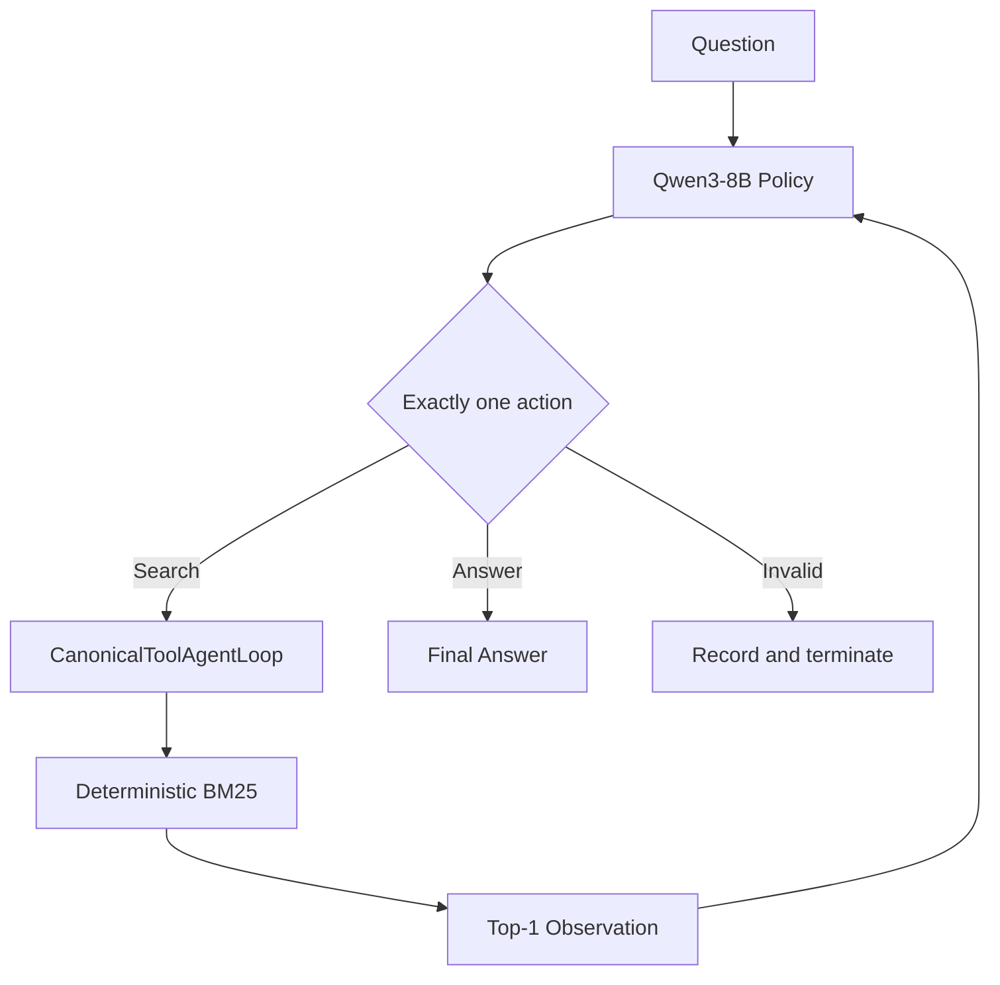

<p align="center"></p>

<h1 align="center">SearchAgent-RL</h1>

<p align="center"><strong>Reinforcement Learning for Multi-turn Search Agents</strong></p>

<p align="center">Training Qwen3-8B to search, reason, and answer through multi-turn interaction with GRPO, process-aware rewards, and behavioral evaluation.</p>

<p align="center">    </p>

<picture><source media="(prefers-color-scheme: dark)" srcset="assets/hero-dark.svg"><source media="(prefers-color-scheme: light)" srcset="assets/hero-light.svg"></picture>

SearchAgent-RL trains Qwen3-8B for multi-hop QA through multi-turn search, then evaluates answer quality alongside exploration depth, useful/wasted retrieval, and protocol validity. The stack uses verl, vLLM, FSDP, and a strict search-agent loop.

## Results at a Glance

Natural Bridge-Hard, 200 held-out HotpotQA examples:

| Metric | Base | Vanilla GRPO |
|---|---:|---:|
| EM ↑ | 32.5% | **51.5%** |
| F1 ↑ | 42.03% | **62.53%** |
| Multi-search ↑ | 31.5% | **86.0%** |
| Invalid Action ↓ | 10.06% | **0.17%** |

**GRPO improves both answer quality and search behavior:** the agent becomes
substantially more willing to perform multi-hop retrieval while almost
eliminating invalid actions.

## Why Multi-turn Search RL?

A system may support repeated search while its policy always follows
`search once → answer`. SearchAgent-RL distinguishes:

- **Capability:** can the runtime execute another search?
- **Necessity:** does the first observation leave required evidence unresolved?
- **Behavior:** does the policy choose a useful next query?

Top-1 retrieval creates genuine information demand for later turns. RL is
trained on complete `search → observe → reason → search → answer` trajectories,
not isolated responses.

## Agent Loop



Each assistant turn emits exactly one action:

```xml
<tool_call>
{"name":"search","arguments":{"query":"Hunter Davies born"}}
</tool_call>
```

or:

```xml
<answer>7 January 1936</answer>
```

| Constraint | Value |
|---|---:|
| Maximum assistant turns | 5 |
| Maximum executed searches | 3 |
| Parallel calls per turn | 1 |
| Results per search | 1 |
| Observation limit | 384 tokens |
| Response trajectory limit | 1,024 tokens |

A search observation is appended to context before the next policy decision.
Malformed, mixed, unknown, or over-budget actions are logged and never silently
executed. An episode terminates on a valid answer, turn/search exhaustion, or a
native protocol violation. The project-local
[`CanonicalToolAgentLoop`](src/efficienttool_rl/verl/canonical_agent_loop.py)
keeps local evaluation and verl's native async `ToolAgentLoop` aligned without
modifying upstream verl. Parser edge cases are covered in
[`protocol.py`](src/efficienttool_rl/protocol.py).

## Example: A Two-hop Search Trajectory

This is a real successful Natural Bridge-Hard trajectory
`5ae63dad55429929b0807afe__rollout_0`. Both searches retrieved a new gold
supporting document.

```text
Question:
When was the British author who wrote the novel on which
"Here We Go Round the Mulberry Bush" was based born?

Turn 1 — Search:
British author novel Here We Go Round the Mulberry Bush

Observation 1 — Here We Go Round the Mulberry Bush (film):
The 1967 British film was based on the novel of the same name
by Hunter Davies.

Turn 2 — Search:
Hunter Davies born

Observation 2 — Hunter Davies:
Edward Hunter Davies, OBE (born 7 January 1936) is a British author,
journalist and broadcaster.

Final Answer:
<answer>7 January 1936</answer>
```

The second query depends on the bridge entity revealed by the first retrieval,
which makes this a genuine multi-turn search problem.

## Agentic RL Pipeline


With 32 questions and group size 4, an update samples 128 complete agent
trajectories. Reward is trajectory-level and each rollout may include multiple
assistant actions and tool observations.

## Reinforcement Learning with GRPO

For each question, GRPO samples grouped trajectories:

$$
\{\tau_1,\ldots,\tau_G\}\sim\pi_\theta,\qquad G=4.
$$

It converts their rewards into group-relative advantages:

$$
A_i=\frac{R_i-\mu_R}{\sigma_R+\epsilon}.
$$

Better-than-group search-and-answer trajectories receive positive advantage;
worse ones receive negative advantage. The policy is updated with a clipped
objective and an actor KL coefficient of `0.001`, without a learned critic.
The 2,000-prompt baseline completed 62 optimizer updates. Its zero-variance
group ratio was 0.684, yet it still produced substantial held-out gains.

See the exact [GRPO config](configs/grpo/qwen8b_hotpot_mt_strict.yaml).

## Reward Engineering

### Task Reward

Final-answer correctness remains the primary optimization objective:

$$
R_{\text{answer}}=0.5\,EM+0.5\,F1.
$$

Outputs without exactly one valid terminal `<answer>` receive zero.

### Reward v2

The current process-aware objective is:

$$
R=R_{\text{answer}}
 +\beta_tR_{\text{marginal-evidence}}
 -\lambda R_{\text{answer}}N_{\text{wasted}},
\quad \beta_t:0.10\rightarrow0,\quad\lambda=0.02.
$$

- **Marginal evidence:** each search receives credit only for newly covered
  gold supporting evidence; duplicate and irrelevant retrievals add zero.
- **Annealing:** evidence weight decays by global optimizer progress, returning
  training toward answer-only optimization.
- **Success-gated waste:** wasted searches are weakly penalized in proportion
  to answer quality, so premature stopping is never rewarded.

The accumulated evidence term is trajectory-level; tool-observation tokens
receive no policy reward. Reward v2 is a **performance–tool-cost trade-off, not
a Pareto improvement** over task-only GRPO. See the
[implementation](src/efficienttool_rl/rewards/reward_v2.py) and
[config](configs/grpo/qwen8b_hotpot_reward_v2.yaml).

### Reward Evolution

| Version | Design | Observed result |
|---|---|---|
| Composite v1 | Answer + final evidence coverage + format | Better than Base, but more wasted retrieval than task-only GRPO |
| Reward v2 | Marginal evidence + annealing + success-gated waste | Better than v1 with fewer wasted searches; still below task-only GRPO on EM/F1 |

Safeguards remain simple: gold metadata never enters model-visible context;
duplicate evidence cannot accumulate reward repeatedly; answer correctness
stays primary; task quality and search behavior are evaluated separately.
The offline v1 audit is in
[`analysis/composite_reward_pilot`](analysis/composite_reward_pilot/README.md).

## Evaluation Results

All rows use the same 200-example Natural Bridge-Hard protocol: official
HotpotQA validation questions with `type=bridge`, `level=hard`, top-1 BM25,
384-token observations, and identical search/turn budgets.

### Task Quality

| Method | EM ↑ | F1 ↑ |
|---|---:|---:|
| Base | 32.5% | 42.03% |
| **Vanilla GRPO** | **51.5%** | **62.53%** |
| Composite v1 | 45.0% | 55.25% |
| Reward v2 | 45.5% | 56.83% |

### Search Behavior

| Method | Searches | Multi-search | Useful | Wasted | Tool efficiency | Invalid action ↓ |
|---|---:|---:|---:|---:|---:|---:|
| Base | 1.335 | 31.5% | 0.965 | 0.370 | 72.28% | 10.06% |
| **Vanilla GRPO** | 1.960 | 86.0% | 1.445 | 0.515 | 73.72% | **0.17%** |
| Composite v1 | 1.885 | 77.5% | 1.250 | 0.635 | 66.31% | 0.52% |
| Reward v2 | 1.675 | 64.0% | 1.250 | 0.425 | 74.63% | 0.37% |

Task-only GRPO gives the best answer quality. Reward v2 improves over Composite
v1 and reduces wasted retrieval, but does not outperform Vanilla GRPO on task
quality. Full provenance and artifact hashes are in
[`experiments/results.md`](experiments/results.md).

## Engineering Stack

| Layer | Implementation |
|---|---|
| Model | Qwen3-8B, bf16 |
| RL | verl, GRPO, grouped trajectory rewards |
| Rollout | vLLM 0.11.0 async generation |
| Distributed training | PyTorch FSDP + Ray |
| Environment | Deterministic per-trajectory BM25 retrieval |
| Protocol | Native ToolAgentLoop + CanonicalToolAgentLoop |
| Evaluation | Hotpot-MT Strict + Natural Bridge-Hard |
| Diagnostics | EM/F1, validity, turns, tokens, attempted/valid/executed/useful/wasted search |

Upstream verl remains unmodified; project adapters and reward managers live
under `src/efficienttool_rl/verl/`.

## Quick Start

```bash
git clone <repository-url> SearchAgent-RL
cd SearchAgent-RL
python -m venv .venv && source .venv/bin/activate
pip install -e ".[test]"
python scripts/smoke_agent_episode.py
```

The CPU smoke uses the real parser, agent loop, and search environment. See the
[`environment report`](docs/environment_report.md) for model setup.

## Training & Evaluation

```bash
export VERL_CONFIG_PATH=/path/to/verl/verl/trainer/config
export ETRL_ROOT="$PWD"
export ETRL_MODEL=/path/to/Qwen3-8B
export ETRL_DATA_DIR=/path/to/prepared/parquet
export ETRL_RUN_DIR=/path/to/run-output

# Task-only GRPO or Reward v2
python scripts/train_grpo.py --config-name qwen8b_hotpot_mt_strict
python scripts/train_grpo.py --config-name qwen8b_hotpot_reward_v2

# Held-out evaluation
python scripts/evaluate.py \
  --data "$ETRL_DATA_DIR/verl_hotpotqa_mt_natural_bridge_hard_val_200.parquet" \
  --model /path/to/checkpoint --output /path/to/eval/trajectories.jsonl \
  --backend vllm --limit 200 --max-turns 5 --max-search-calls 3 \
  --top-k 1 --max-top-k 1 --max-observation-tokens 384
```

Use a persistent session and verify GPU ownership, disk, config, and output paths.

## Additional Studies

We also evaluated DAPO-style training as an auxiliary study. It converged to a
conservative one-search policy and did not outperform Vanilla GRPO; see the
[`DAPO diagnosis`](analysis/dapo_diagnostics/README.md).

Further evidence: [results and provenance](experiments/results.md), [baseline protocol](experiments/baselines.md), [composite reward audit](analysis/composite_reward_pilot/README.md), and [current status](PROGRESS.md).

## Repository Structure

```text
SearchAgent-RL/
├── configs/                  # GRPO, DAPO, and search-loop configuration
├── src/efficienttool_rl/     # Core Python implementation (stable import path)
│   ├── tools/                # Deterministic BM25 search
│   ├── rewards/              # Task and process-aware rewards
│   ├── evaluation/           # Task and behavioral metrics
│   └── verl/                 # Canonical loop and reward-manager adapters
├── scripts/                  # Data, training, evaluation, and analysis CLIs
├── experiments/              # Verified results and provenance
├── analysis/                 # Focused reward and failure studies
├── tests/                    # Unit and integration tests
├── docs/archive/             # Historical plans and superseded narratives
├── AGENTS.md                 # Research-engineering protocol
└── PROGRESS.md               # Current experiment status
```

The source package remains `efficienttool_rl` for import and artifact compatibility.
