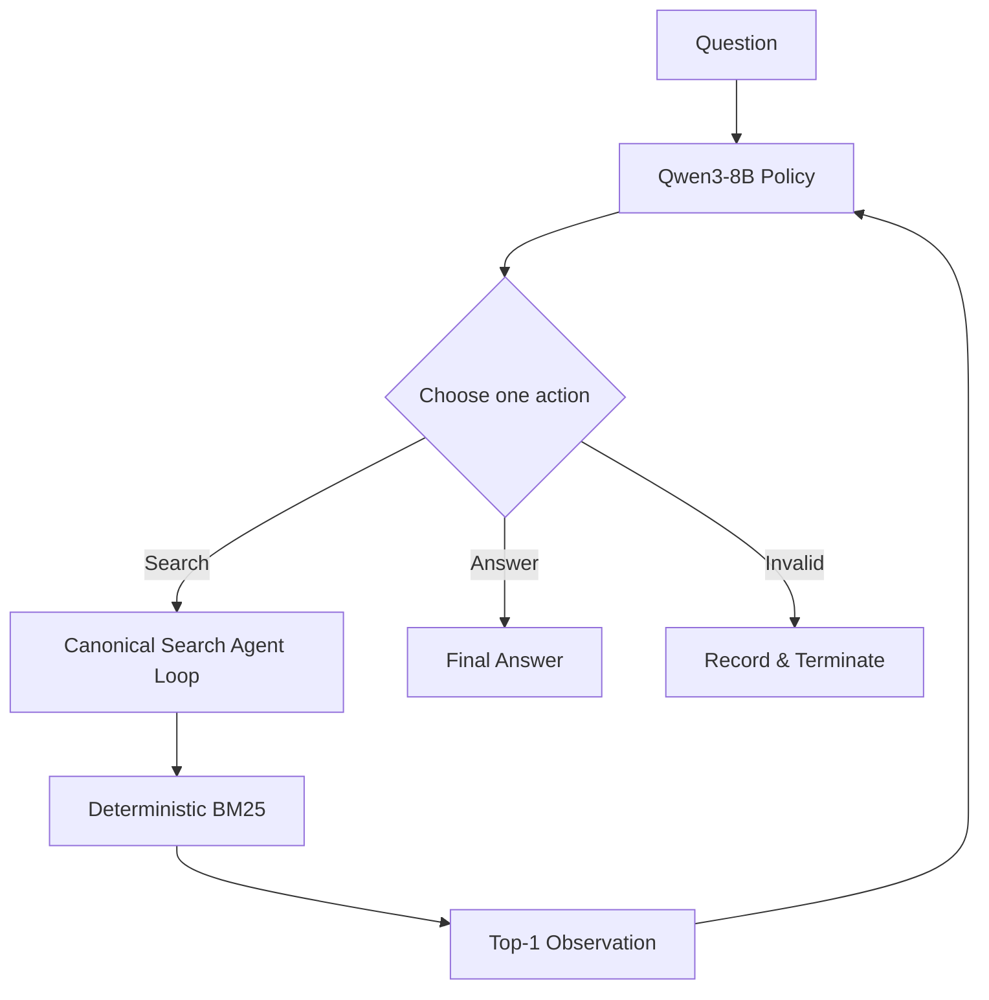

# SearchAgent-RL

<p align="center">
  
</p>

<h3 align="center">Reinforcement Learning for Multi-turn Search Agents</h3>

<p align="center">
Train Qwen3-8B to decide <b>what to search, whether to search again, and when to answer</b> through multi-turn interaction.
</p>

<p align="center">
  Qwen3-8B · GRPO · verl · vLLM · FSDP · Ray · HotpotQA
</p>

<picture>
  <source media="(prefers-color-scheme: dark)" srcset="assets/hero-dark.svg">
  <source media="(prefers-color-scheme: light)" srcset="assets/hero-light.svg">
  
</picture>

**SearchAgent-RL** is a reproducible Agentic RL project for training search agents in a controlled multi-hop retrieval environment.

Instead of evaluating only final-answer accuracy, the project also tracks how RL changes the agent's **search depth, retrieval quality, stopping behavior, and protocol reliability**.

## Results at a Glance

Evaluation on 200 Natural Bridge-Hard examples:

| Metric           | Qwen3-8B Base | Vanilla GRPO |
| ---------------- | ------------: | -----------: |
| EM ↑             |         32.5% |    **51.5%** |
| F1 ↑             |        42.03% |   **62.53%** |
| Multi-search ↑   |         31.5% |    **86.0%** |
| Invalid Action ↓ |        10.06% |    **0.17%** |

**GRPO improves more than answer accuracy.** The trained policy performs substantially more multi-step retrieval while almost eliminating invalid actions.

---

## Task Setting & Motivation

### Why Multi-turn Search?

Many multi-hop questions cannot be solved by retrieving a single passage.

A typical bridge question follows:

```text
Question
   │
   ▼
Search #1
   │
   ▼
Intermediate entity
   │
   ▼
Search #2 conditioned on that entity
   │
   ▼
Answer evidence
   │
   ▼
Final answer
```

The second query depends on information revealed by the first retrieval:

$$
q_{t+1}=f(q,h_t,o_t)
$$

where \(h_t\) contains the previous interaction history and \(o_t\) is the latest search observation.

SearchAgent-RL therefore treats retrieval as a **sequential decision problem**, not a one-shot RAG pipeline.

### Why Reinforcement Learning?

At each turn, the policy chooses between:

$$
a_t \in
\{\operatorname{Search}(query),\operatorname{Answer}(text)\}.
$$

A successful agent must jointly learn:

* what query to issue;
* whether current evidence is sufficient;
* whether another retrieval is necessary;
* when to stop searching;
* how to produce the final answer.

Supervised Tool Calling examples can teach valid syntax. RL instead optimizes the behavior of the **complete search-and-answer trajectory**.

---

## Agent Loop



Each assistant turn must emit exactly one action.

### Search

```xml
<tool_call>
{"name":"search","arguments":{"query":"Hunter Davies born"}}
</tool_call>
```

### Answer

```xml
<answer>7 January 1936</answer>
```

### Interaction Constraints

| Property                  |      Setting |
| ------------------------- | -----------: |
| Maximum assistant turns   |            5 |
| Maximum executed searches |            3 |
| Search results per call   |            1 |
| Parallel calls per turn   |            1 |
| Observation limit         |   384 tokens |
| Response trajectory limit | 1,024 tokens |

Search results are appended to the model context before the next policy decision.

Malformed, mixed, unknown, or over-budget actions are recorded rather than silently executed. The project-local [`CanonicalToolAgentLoop`](src/efficienttool_rl/verl/canonical_agent_loop.py) keeps local evaluation aligned with verl's native asynchronous `ToolAgentLoop`.

Parser and protocol handling live in [`protocol.py`](src/efficienttool_rl/protocol.py).

---

## Example: A Two-hop Search Trajectory

The following is a real successful Natural Bridge-Hard trajectory:

```text
Question:
When was the British author who wrote the novel on which
"Here We Go Round the Mulberry Bush" was based born?

Turn 1
Search:
British author novel Here We Go Round the Mulberry Bush

Observation:
The 1967 British film was based on the novel of the same name
by Hunter Davies.

Turn 2
Search:
Hunter Davies born

Observation:
Edward Hunter Davies, OBE (born 7 January 1936) is a British author,
journalist and broadcaster.

Final:
<answer>7 January 1936</answer>
```

The first retrieval identifies the bridge entity **Hunter Davies**. Only then can the agent formulate the second query that retrieves the answer evidence.

This dependency is exactly the behavior that one-shot retrieval fails to model.

---

## Agentic RL Pipeline

For each question, the policy samples a group of complete multi-turn trajectories:


A trajectory may contain multiple policy decisions and environment observations:

```text
question
  → search
  → observation
  → search
  → observation
  → answer
```

With batch size 32 and group size 4, each optimizer update evaluates 128 complete agent trajectories.

---

## Reinforcement Learning with GRPO

For each question \(q\), GRPO samples:

$$
\{\tau_1,\ldots,\tau_G\}\sim\pi_\theta,
\qquad G=4.
$$

The trajectory rewards are normalized within the group:

$$
A_i=
\frac{R_i-\mu_R}
{\sigma_R+\epsilon}.
$$

Trajectories that outperform alternatives for the same question receive positive advantage, while weaker trajectories receive negative advantage.

The policy is then optimized with a clipped objective without training a separate critic.

The main Vanilla GRPO run uses:

* Qwen3-8B;
* 2,000 training prompts;
* 4 rollouts per prompt;
* 62 optimizer updates;
* asynchronous vLLM generation;
* FSDP distributed training;
* actor KL coefficient `0.001`.

See the exact [training configuration](configs/grpo/qwen8b_hotpot_mt_strict.yaml).

---

## Reward Engineering

### Task Reward

The strongest-performing training recipe uses a simple final-answer reward:

$$
R_{\text{answer}}
=
0.5\,EM+0.5\,F1.
$$

This intentionally does **not** directly reward search depth or tool usage.

The result is important: task-only GRPO is already able to learn substantially stronger multi-step search behavior from trajectory-level outcome feedback.

### Process-aware Reward v2

We also investigate whether explicit process signals can produce a cleaner retrieval policy.

Reward v2 uses:

$$
R =
R_{\text{answer}}
+
\beta_t R_{\text{evidence}}
-
\lambda R_{\text{answer}}N_{\text{non-support}},
$$

with

$$
\beta_t:0.10\rightarrow0,
\qquad
\lambda=0.02.
$$

The design has three components:

**Evidence shaping.**
Newly covered gold supporting documents contribute evidence gain; duplicate retrieval does not accumulate additional evidence reward.

**Annealing.**
The evidence coefficient decays with optimizer progress so that training gradually returns toward answer-quality optimization.

**Success-gated search regularization.**
Non-support retrieval receives only a weak penalty proportional to answer quality. The objective therefore does not directly reward premature stopping.

The current implementation still uses a **trajectory-level scalar reward**. Incremental evidence statistics provide process diagnostics, but are not action-local policy-gradient credit.

Reward metadata such as gold answers and supporting-document labels is used only offline and is never inserted into the model-visible prompt or search observation.

See the [Reward v2 implementation](src/efficienttool_rl/rewards/reward_v2.py).

---

## Evaluation

All methods below are evaluated on the same **Natural Bridge-Hard evaluation set**: 200 official HotpotQA validation examples with:

* `type = bridge`;
* `level = hard`;
* deterministic top-1 BM25 retrieval;
* identical turn and search budgets;
* 384-token observations.

### Task Quality

| Method              |      EM ↑ |       F1 ↑ |
| ------------------- | --------: | ---------: |
| Qwen3-8B Base       |     32.5% |     42.03% |
| **Vanilla GRPO**    | **51.5%** | **62.53%** |
| Composite Reward v1 |     45.0% |     55.25% |
| Reward v2           |     45.5% |     56.83% |

### Search Behavior

| Method           | Searches | Multi-search ↑ | Support-hit | Non-support | Support-hit Rate ↑ | Invalid ↓ |
| ---------------- | -------: | -------------: | ----------: | ----------: | -----------------: | --------: |
| Base             |    1.335 |          31.5% |       0.965 |       0.370 |             72.28% |    10.06% |
| **Vanilla GRPO** |    1.960 |      **86.0%** |   **1.445** |       0.515 |             73.72% | **0.17%** |
| Composite v1     |    1.885 |          77.5% |       1.250 |       0.635 |             66.31% |     0.52% |
| Reward v2        |    1.675 |          64.0% |       1.250 |   **0.425** |         **74.63%** |     0.37% |

Here, **Support-hit** means an executed search that retrieves a previously unseen gold supporting document. **Non-support** is the complementary annotation-based proxy; these metrics should not be interpreted as perfect semantic measures of whether a search was useful to the model.

### What did we learn?

**1. Task-only GRPO is the strongest overall policy.**

It improves both answer quality and multi-step exploration:

$$
EM:\ 32.5\%\rightarrow51.5\%
$$

$$
MultiSearch:\ 31.5\%\rightarrow86.0\%.
$$

**2. More searching is not automatically better.**

GRPO increases both support-hit and non-support retrieval. Search count therefore needs to be evaluated together with answer quality and retrieval quality.

**3. Process reward introduces a trade-off rather than a free improvement.**

Reward v2 reduces non-support retrieval relative to Composite v1 while maintaining similar task quality, but it still trails task-only GRPO on EM/F1.

For complete metrics, run provenance, and artifact hashes, see [`experiments/results.md`](experiments/results.md).

---

## Engineering Stack

| Layer                | Implementation                                         |
| -------------------- | ------------------------------------------------------ |
| Base model           | Qwen3-8B                                               |
| RL training          | verl + GRPO                                            |
| Rollout engine       | vLLM async generation                                  |
| Distributed training | PyTorch FSDP + Ray                                     |
| Search environment   | Deterministic per-trajectory BM25                      |
| Agent runtime        | Native ToolAgentLoop + project-local canonical adapter |
| Dataset              | HotpotQA multi-hop QA                                  |
| Evaluation           | Answer quality + behavioral search metrics             |
| Tests                | 104 unit/integration tests                             |

Upstream verl remains unmodified. Project-specific agent-loop and reward-manager adaptations are isolated under [`src/efficienttool_rl/verl`](src/efficienttool_rl/verl/).

---

## Quick Start

```bash
git clone https://github.com/Idiotyevsky/EfficientTool-RL.git SearchAgent-RL
cd SearchAgent-RL

python -m venv .venv
source .venv/bin/activate

pip install -e ".[test]"
pytest -q

python scripts/smoke_agent_episode.py
```

The CPU smoke test exercises the real parser, search environment, and agent loop without requiring a full RL training run.

For the validated GPU software stack, see [`docs/environment_report.md`](docs/environment_report.md).

---

## Training

Set the verl, model, data, and output paths:

```bash
export VERL_CONFIG_PATH=/path/to/verl/verl/trainer/config
export ETRL_ROOT="$PWD"
export ETRL_MODEL=/path/to/Qwen3-8B
export ETRL_DATA_DIR=/path/to/prepared/parquet
export ETRL_RUN_DIR=/path/to/run-output
```

### Vanilla GRPO

```bash
python scripts/train_grpo.py \
  --config-name qwen8b_hotpot_mt_strict
```

### GRPO + Reward v2

```bash
python scripts/train_grpo.py \
  --config-name qwen8b_hotpot_reward_v2
```

---

## Evaluation

```bash
python scripts/evaluate.py \
  --data "$ETRL_DATA_DIR/verl_hotpotqa_mt_natural_bridge_hard_val_200.parquet" \
  --model /path/to/checkpoint \
  --output /path/to/eval/trajectories.jsonl \
  --backend vllm \
  --limit 200 \
  --max-turns 5 \
  --max-search-calls 3 \
  --top-k 1 \
  --max-top-k 1 \
  --max-observation-tokens 384
```

Training recipes, model checkpoints, and evaluation runs should use identical search budgets when compared.

---

## Additional Studies

### Composite Reward v1

An earlier reward combined final-answer quality, final supporting-document coverage, and protocol-format signals.

Offline analysis showed that evidence coverage carries useful signal while format reward is already near ceiling. Reward v2 therefore removes the format component and introduces annealing plus weak search regularization.

See the [`Composite Reward Pilot`](analysis/composite_reward_pilot/README.md).

### DAPO

DAPO-style training was also evaluated as an auxiliary experiment.

In the current setting it converged toward a conservative one-search policy and did not outperform Vanilla GRPO. Because this behavior is not part of the main project claim, the detailed analysis is kept separate:

[`DAPO Diagnosis`](analysis/dapo_diagnostics/README.md)

---

## Repository Structure

```text
SearchAgent-RL/
├── configs/
│   └── grpo/                  # Training recipes
├── src/efficienttool_rl/
│   ├── tools/                 # BM25 search environment
│   ├── rewards/               # Task and process-aware rewards
│   ├── evaluation/            # Task and behavioral metrics
│   └── verl/                  # Agent-loop / reward-manager adapters
├── scripts/                   # Data, training, evaluation, analysis
├── experiments/               # Verified results and provenance
├── analysis/                  # Focused auxiliary studies
├── tests/                     # Unit and integration tests
└── docs/                      # Environment and archived development notes
```

The Python import package remains `efficienttool_rl` for backward compatibility with existing runs and artifacts.

---

## Reproducibility

For completed experiments, the repository records:

* exact training configuration;
* random seed;
* dataset fingerprint;
* checkpoint step;
* evaluation protocol;
* trajectory artifacts;
* SHA-256 hashes for published evaluation outputs.

See [`experiments/results.md`](experiments/results.md) for the canonical experiment table.

---

## Scope

SearchAgent-RL is intentionally a **controlled multi-hop retrieval testbed**.

The current environment uses per-example HotpotQA distractor passages and deterministic BM25 retrieval rather than an open-web search engine. This keeps the environment reproducible and makes changes in agent search behavior easier to attribute to RL training.

The project therefore studies:

> **how reinforcement learning shapes sequential search policies**

rather than claiming general web-search-agent capability.
