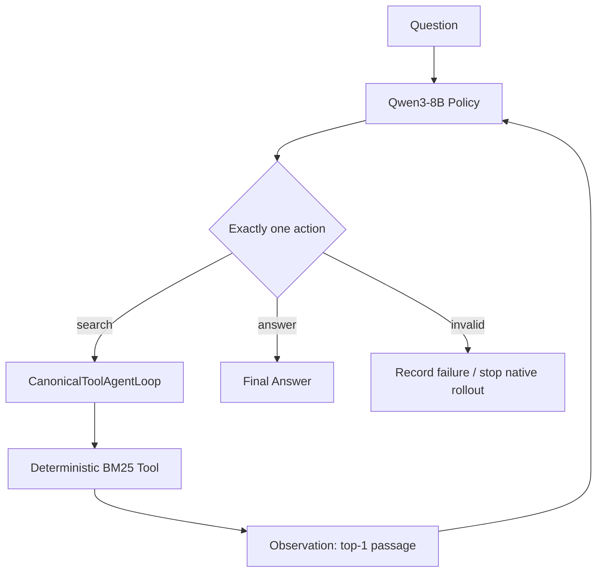

# ToolAgentLab

> **A reproducible testbed for training and diagnosing multi-turn tool agents with reinforcement learning.**

ToolAgentLab trains a Qwen3-8B policy to search a deterministic local corpus,
reason across observations, and answer multi-hop questions. It connects a
strict action protocol to native multi-turn rollouts in verl/vLLM, then compares
how GRPO and DAPO change task quality and agent behavior.

The public name is **ToolAgentLab**. The Python package remains
`efficienttool_rl` so existing imports, configs, checkpoints, and artifacts
stay compatible.

## Overview

```text
HotpotQA question → Qwen3-8B tool agent → multi-turn BM25 interaction
                  → trajectory reward → grouped RL → policy update
                  → held-out task and behavior evaluation
```

Every policy is measured with EM/F1, completion, protocol validity, turns, and
attempted/valid/executed/useful/wasted tool calls.

## Why Multi-turn Tool RL?

A model can support tools without learning when to use them. A loop can permit
five turns while the policy always follows `search once → answer`. ToolAgentLab
separates:

1. **Capability:** can the runtime execute another action?
2. **Necessity:** does one search leave required information unresolved?
3. **Behavior:** does the policy choose a useful next search?

The controlled environment returns one passage per search, allowing one
observation to reveal the entity needed for the next query. RL is trained and
diagnosed on complete search-and-answer trajectories, not isolated responses.

## Agent Loop



The project-local
[`CanonicalToolAgentLoop`](src/efficienttool_rl/verl/canonical_agent_loop.py)
adapts verl's native async `ToolAgentLoop` to the strict parser used in local
evaluation. verl still owns generation, tool execution, response masks, and
rollout orchestration; upstream source is not modified.

### Action Space

Each assistant turn emits exactly one action:

```xml
<tool_call>
{"name":"search","arguments":{"query":"Hunter Davies born"}}
</tool_call>
```

or:

```xml
<answer>7 January 1936</answer>
```

The [parser](src/efficienttool_rl/protocol.py) rejects missing or multiple
blocks, malformed tags/JSON, missing arguments, and invalid argument types.
Unknown tools are never executed.

### Interaction Protocol

| Constraint | Current value |
|---|---:|
| Maximum assistant turns | 5 |
| Maximum user/tool-response turns | 5 |
| Maximum parallel calls per turn | 1 |
| Maximum executed searches | 3 |
| Results per search | 1 |
| Maximum observation length | 384 tokens |
| Maximum response trajectory | 1,024 tokens |

A valid search observation is appended to the context and feeds the next
policy decision. During native training, an invalid or mixed action terminates
the rollout without silently executing another call. Local evaluation records
an error observation so the failure stays inspectable. Both paths log malformed
output rather than crashing.

### Episode Lifecycle

An episode ends on a valid `<answer>`, five assistant turns, an exhausted
three-search budget, or a native protocol violation. Its trajectory preserves
all actions, observations, execution decisions, the answer, and termination
reason.

## Task & Dataset

### HotpotQA

Training uses **Hotpot-MT Strict**, a controlled HotpotQA distractor-derived
split: bridge-oriented questions, deterministic per-example BM25, top-1
retrieval, bounded observations, and a three-search budget. This is a
multi-turn stress test, not the unmodified HotpotQA benchmark.

### A Multi-hop Example

This is a real successful Natural Bridge-Hard trajectory
(`5ae63dad55429929b0807afe__rollout_0`, Fresh DAPO evaluation). Both calls
retrieved a new gold supporting document.

**Question**

> When was the British author who wrote the novel on which "Here We Go Round
> the Mulberry Bush" was based born?

**Turn 1**

```xml
<tool_call>
{"name":"search","arguments":{"query":"British author novel Here We Go Round the Mulberry Bush"}}
</tool_call>
```

**Observation 1 — _Here We Go Round the Mulberry Bush (film)_**

> The 1967 British film was based on the novel of the same name by Hunter
> Davies.

The bridge entity is now known, but the birth date is not.

**Turn 2**

```xml
<tool_call>
{"name":"search","arguments":{"query":"Hunter Davies born"}}
</tool_call>
```

**Observation 2 — _Hunter Davies_**

> Edward Hunter Davies, OBE (born 7 January 1936) is a British author,
> journalist and broadcaster.

**Final**

```xml
<answer>7 January 1936</answer>
```

The second query depends on an entity revealed by the first observation:
genuine multi-turn retrieval rather than repeated single-turn QA.

### Natural Bridge-Hard Evaluation

The held-out comparison uses 200 official validation rows with `type=bridge`
and `level=hard`, without the strict question-level filter. Every method uses
identical top-1 retrieval, 384-token observations, three-search and five-turn
limits. The parquet fingerprint is in
[the baseline report](experiments/baselines.md).

## Agentic RL Pipeline


One rollout contains the complete interaction:

```text
reason → search → observation → reason → search → observation → answer
```

With batch size 32 and group size 4, one update begins with 32 questions and
samples 128 trajectories before filtering or optimization.

## Reinforcement Learning

### Vanilla GRPO

For one question, GRPO samples a group:

$$
\{\tau_1,\ldots,\tau_G\}\sim\pi_\theta, \qquad G=4.
$$

Trajectory rewards are normalized within that group:

$$
A_i=\frac{R_i-\mu_R}{\sigma_R+\epsilon}.
$$

Above-average trajectories receive positive advantage; below-average ones
receive negative advantage. The clipped objective increases the probability of
better search-and-answer behavior without a learned critic. The baseline also
uses an actor KL loss of `0.001`.

The 2,000-prompt run reached a **0.684 zero-variance group ratio**: roughly two
thirds of sampled groups carried no relative signal. Despite this sparsity, the
completed run substantially improved held-out EM and F1.

### DAPO

DAPO is evaluated as a modified GRPO recipe, not a method that must be better:

- **Dynamic Sampling:** replace zero-variance groups until the effective batch
  is filled, with a bounded retry cap.
- **Clip-Higher:** asymmetric clipping (0.20 lower, 0.28 upper).
- **Token-level PG Loss:** `token-mean` aggregation.
- **Overlong Reward Shaping:** a soft penalty in the last 256 tokens of the
  1,024-token response budget.

Tool observations are environment output, not policy actions. The corrected
project-local DAPO manager measures overlong length from the assistant
`response_mask` only; it does not alter policy-loss masks or upstream verl.
The completed **Fresh DAPO** result predates this correction: async prefilled
scores bypassed overlong shaping, so it is a DAPO-recipe result without an
effective overlong term.

### GRPO vs DAPO

| Setting | Vanilla GRPO | Fresh DAPO |
|---|---:|---:|
| Group size | 4 | 4 |
| Train batch | 32 prompts | 32 effective prompts |
| Dynamic variance filtering | No | Yes; max 30 generation batches |
| Policy clip | verl default | low 0.20 / high 0.28 |
| Loss aggregation | verl default | token-mean |
| Actor KL loss | 0.001 | disabled |
| Nominal overlong buffer | disabled | 256 tokens; factor 1.0 |
| Temperature / top-p | 0.8 / 0.95 | 0.8 / 0.95 |
| Learning rate / seed | 1e-6 / 42 | 1e-6 / 42 |
| Optimizer updates | 62 | 62 |

Both recipes share the model, task, protocol, rollout engine, search
environment, and evaluator. See the exact
[GRPO config](configs/grpo/qwen8b_hotpot_mt_strict.yaml) and
[DAPO config](configs/dapo/qwen8b_hotpot_mt_strict.yaml).

## Reward Design

### Task Reward

Vanilla GRPO and Fresh DAPO use:

$$
R_{\text{task}}=0.5\,EM+0.5\,F1.
$$

An output without exactly one valid terminal `<answer>` receives zero. The
reward supervises the final answer, not retrieval quality.

### Process-aware Composite Reward

The implemented objective is:

$$
R=0.8R_{\text{answer}}+0.15R_{\text{evidence}}+0.05R_{\text{format}}.
$$

- **Answer:** the same `0.5 EM + 0.5 F1` score.
- **Evidence coverage:** the fraction of unique gold supporting-document titles
  returned by successful searches, capped at 1.
- **Format:** the mean of three binary checks—a valid terminal answer, no
  malformed/unknown calls, and termination with the answer.

Gold and retrieved titles are sets, so repeating retrieval cannot accumulate
evidence reward. Offline replay confirmed non-zero evidence variance and
positive correlation with exact match while answer reward retained the largest
share of total reward. See the
[composite reward pilot](analysis/composite_reward_pilot/README.md).

### Reward-hacking Safeguards

- Gold answers and supporting titles are reward/evaluation metadata only; they
  never enter model-visible context or tool kwargs.
- Evidence coverage is duplicate-insensitive and saturating.
- Answer quality keeps 80% of the composite objective.
- Component distributions are audited offline before RL.
- Task quality and tool behavior are reported together; fewer calls are never
  called an improvement when answer quality collapses.

## Results

All values were recomputed from stored trajectories on the same
**Natural Bridge-Hard 200-example held-out evaluation**.

### Task Quality

| Method | EM | F1 |
|---|---:|---:|
| Qwen3-8B Base | 32.5% | 42.03% |
| Vanilla GRPO, step 62 | **51.5%** | **62.53%** |
| Composite-reward GRPO, step 62 | 45.0% | 55.25% |
| Fresh DAPO, step 62 | 33.0% | 41.83% |

### Tool-use Behavior

| Method | Searches | Multi-search | Useful | Wasted |
|---|---:|---:|---:|---:|
| Qwen3-8B Base | 1.335 | 31.5% | 0.965 | 0.370 |
| Vanilla GRPO, step 62 | 1.960 | 86.0% | 1.445 | 0.515 |
| Composite-reward GRPO, step 62 | 1.885 | 77.5% | 1.250 | 0.635 |
| Fresh DAPO, step 62 | 1.100 | 10.0% | 0.880 | 0.220 |

Fresh DAPO also reached 100% completion, 0% invalid actions, 80.0% tool
efficiency (useful/executed), 0.3742 average task reward, and 2.10 average
turns. Composite-reward GRPO reached 98.0% completion, 0.52% invalid actions,
and 66.31% tool efficiency. It remains stronger than Base but does not exceed
task-only GRPO: useful retrieval falls while wasted retrieval rises. Full
provenance is in [experiments/results.md](experiments/results.md).

## Case Study: DAPO's One-search Collapse

Fresh DAPO produced stable syntax—100% completion and no invalid actions—but
converged toward:

```text
search once → answer
```

Compared with vanilla GRPO, multi-search fell from **86% to 10%**, while EM
fell from **51.5% to 33.0%**. Wasted search also fell from 0.515 to 0.220, but
this is **not treated as an efficiency improvement because reduced retrieval
comes with a large task-quality regression**.

The current diagnosis remains a working hypothesis: recipe-level changes
encouraged a short, stable policy, and overlong accounting may be one
contributor. The completed run did not apply its configured overlong term,
while stock trajectory length is not agent-aware because tool observations
share the sequence. A corrected assistant-only experiment is required before
assigning causality. See the
[DAPO diagnosis](analysis/dapo_diagnostics/README.md).

## Engineering

- **Policy:** Qwen3-8B in bf16.
- **Rollouts:** vLLM 0.11.0 async generation, four trajectories per question.
- **Training:** verl's unified PPO-family trainer, FSDP full sharding with
  parameter/optimizer offload, and Ray orchestration.
- **Runtime:** native multi-turn `ToolAgentLoop` plus a project-local adapter.
- **Environment:** deterministic per-trajectory BM25 over HotpotQA distractor
  passages; no live web dependency.
- **Evaluation:** one held-out protocol for Base, GRPO, and DAPO, with complete
  JSONL trajectories and behavioral metrics.
- **Isolation:** upstream verl stays unmodified; project adapters and reward
  managers live under `src/efficienttool_rl/verl/`.

## Quick Start

```bash
git clone <repository-url> toolagentlab
cd toolagentlab
python -m venv .venv
source .venv/bin/activate
pip install -e ".[test]"
python scripts/smoke_agent_episode.py
pytest -q
```

The CPU smoke uses the actual parser, agent loop, and deterministic search
tool. Model setup is in [the environment report](docs/environment_report.md).

## Training

```bash
export VERL_CONFIG_PATH=/path/to/verl/verl/trainer/config
export ETRL_ROOT="$PWD"
export ETRL_MODEL=/path/to/Qwen3-8B
export ETRL_DATA_DIR=/path/to/prepared/parquet
export ETRL_RUN_DIR=/path/to/run-output

python scripts/train_grpo.py --config-name qwen8b_hotpot_mt_strict
python scripts/train_grpo.py --config-name qwen8b_hotpot_mt_strict_composite
python scripts/train_dapo.py --config-name qwen8b_hotpot_mt_strict
```

Use a persistent session or scheduler for long runs. Verify GPU ownership, disk
capacity, resolved config, and output location before launch.

## Evaluation

```bash
python scripts/evaluate.py \
  --data "$ETRL_DATA_DIR/verl_hotpotqa_mt_natural_bridge_hard_val_200.parquet" \
  --model /path/to/checkpoint \
  --output /path/to/eval/trajectories.jsonl \
  --backend vllm \
  --limit 200 \
  --max-turns 5 \
  --max-search-calls 3 \
  --top-k 1 \
  --max-top-k 1 \
  --max-observation-tokens 384
```

Inspect stored results with:

```bash
python scripts/analyze_rollouts.py --help
python scripts/analyze_trajectories.py --help
```

## Repository Structure

```text
ToolAgentLab/
├── configs/
│   ├── grpo/                 # Vanilla and composite GRPO recipes
│   ├── dapo/                 # DAPO recipes
│   └── tool/                 # Tool schema and loop registration
├── src/efficienttool_rl/     # Stable package; intentionally not renamed
│   ├── agent.py              # Inspectable local episode loop
│   ├── protocol.py           # Strict one-action parser
│   ├── tools/                # Deterministic BM25 search
│   ├── rewards/              # Task and process-aware rewards
│   ├── evaluation/           # Task and behavior metrics
│   └── verl/                 # Native adapters and DAPO reward manager
├── scripts/                  # Data, training, evaluation, and analysis CLIs
├── experiments/              # Stable results and provenance
├── analysis/                 # Reward and failure analyses
├── tests/                    # Unit and integration tests
├── docs/archive/             # Historical milestone records
├── AGENTS.md                 # Research-engineering protocol
└── PROGRESS.md               # Concise experiment status
```

The repository currently has no project-level license. Upstream model,
framework, and dataset licenses still apply; do not assume redistribution or
derivative-use permission until a top-level license is added.
