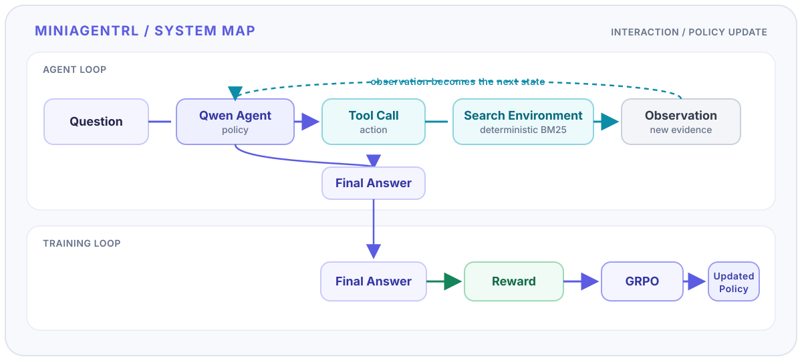
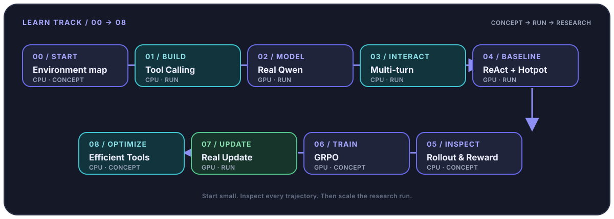
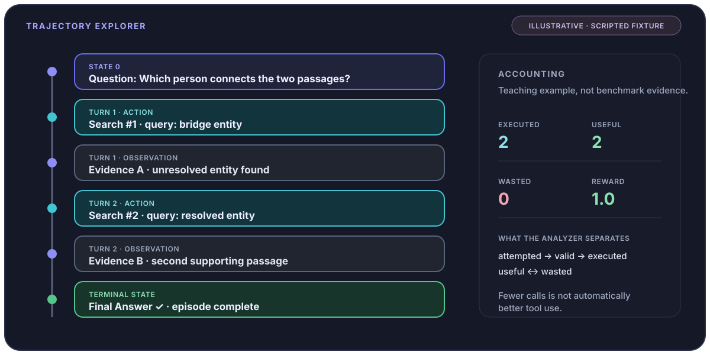
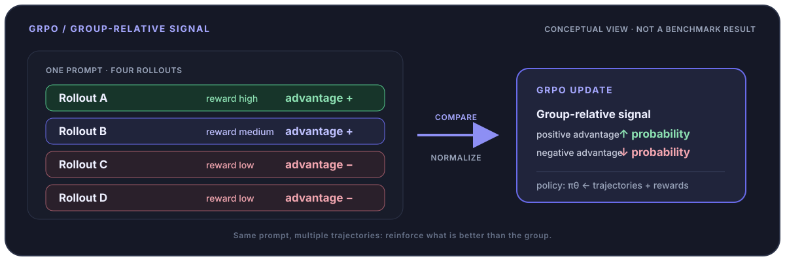

<p align="center">
  
</p>

<h1 align="center">MiniAgentRL</h1>

<p align="center">
  <strong>Learn Agentic RL by building it.</strong><br />
  Start from a minimal tool-using agent, then build your way through multi-turn interaction, trajectories, rewards, and GRPO — all the way to a real parameter update.
</p>

<p align="center">
  <code>Qwen3</code> · <code>Tool Calling</code> · <code>Multi-turn</code> ·
  <code>GRPO</code> · <code>verl</code> · <code>vLLM</code>
</p>

<p align="center">
  <a href="README.md">中文</a> ·
  <a href="README_EN.md">English</a>
</p>

<p align="center">
  <a href="https://idiotyevsky.github.io/EfficientTool-RL/learn/00-start">Start Learning</a> ·
  <a href="https://idiotyevsky.github.io/EfficientTool-RL/">Documentation</a> ·
  <a href="https://idiotyevsky.github.io/EfficientTool-RL/playground/trajectories">Trajectory Explorer</a> ·
  <a href="https://idiotyevsky.github.io/EfficientTool-RL/research/">Research</a>
</p>

<p align="center">
  <a href="https://www.python.org/"></a>
  <a href="https://huggingface.co/Qwen"></a>
  <a href="https://huggingface.co/docs/trl/main/en/grpo_trainer"></a>
  <a href="https://github.com/volcengine/verl"></a>
  <a href="https://github.com/vllm-project/vllm"></a>
</p>

<picture>
  <source media="(prefers-color-scheme: dark)" srcset="./assets/hero-dark.svg" />
  <source media="(prefers-color-scheme: light)" srcset="./assets/hero-light.svg" />
  
</picture>

<p align="center"><em>From a single tool call to a complete Agentic RL training loop.</em></p>

<picture>
  <source media="(prefers-color-scheme: dark)" srcset="./assets/course-roadmap.svg" />
  <source media="(prefers-color-scheme: light)" srcset="./assets/course-roadmap.svg" />
  
</picture>

<p align="center"><em>A continuous path from Start to Efficient Tool Use.</em></p>

## Why MiniAgentRL?

Many Agent tutorials stop at Tool Calling: define a few tools, write a ReAct-style prompt, and let the model search, call APIs, or execute functions. The more interesting question is: **how is the agent actually trained?**

MiniAgentRL breaks that full pipeline into understandable pieces:

```text
Tool Calling → Multi-turn Agent → Trajectory / Rollout
             → Reward → GRPO → Updated Policy
```

The course starts with small, inspectable examples and gradually reconnects them into a real Agentic RL system. Begin with CPU lessons, let Qwen3-1.7B generate real Tool Calls, and finish with an actual GRPO parameter update through `verl + vLLM`.

## What will you build?

| Module | What you learn |
| --- | --- |
| **Tool Calling** | Understand the boundary between model text, structured actions, and tool execution. |
| **Multi-turn Agent** | Feed observations back into context and change the next decision. |
| **GRPO Training** | Connect grouped rollouts, rewards, and advantages to a parameter update. |
| **Efficient Tool Use** | Separate necessary exploration from wasted calls instead of counting calls alone. |

## Learning path

| Chapter | What you learn | Runtime |
| --- | --- | --- |
| **00 · Start** | Environment check and the Agentic RL map | CPU |
| **01 · Tool Calling** | From generated text to actual tool execution | CPU |
| **02 · Real Qwen** | Let Qwen3 generate a real Tool Call | GPU |
| **03 · Multi-turn** | How observations become the next state | CPU |
| **04 · ReAct + HotpotQA** | Run the agent on real multi-hop QA | GPU |
| **05 · Rollout & Reward** | Turn complete trajectories into reward | CPU |
| **06 · GRPO** | From reward to advantage and policy update | CPU |
| **07 · Real Update** | Run an actual GRPO parameter update | GPU |
| **08 · Efficient Tools** | Analyze useful and wasted tool calls | CPU |

Start with [Chapter 00](https://idiotyevsky.github.io/EfficientTool-RL/learn/00-start), or jump to [Multi-turn](https://idiotyevsky.github.io/EfficientTool-RL/learn/03-multiturn) or [GRPO](https://idiotyevsky.github.io/EfficientTool-RL/learn/06-grpo) if you already know ReAct or Function Calling.

## See the agent's behavior



A final answer hides most of what matters in an agent trajectory. MiniAgentRL separates `attempted → valid → executed → useful / wasted` so a necessary search is not treated as the same cost as a call that adds no new evidence.

## How does reward become a parameter update?



One prompt produces multiple trajectories, and the model learns from their relative quality. The Learn Track includes a real one-update demonstration through the `verl + vLLM` pipeline: you can inspect reward, gradient, and optimizer-step evidence. A successful update proves that the training path works; it does not, by itself, prove benchmark improvement.

## Quick Start

The fastest entry point requires no GPU and no model download:

```bash
git clone https://github.com/Idiotyevsky/EfficientTool-RL.git
cd EfficientTool-RL
pip install -e ".[test]"
PYTHONPATH=src python examples/01_tool_calling.py
```

You should see `Model Output → Parsed Action → Search Observation`. Next, [start the full course](https://idiotyevsky.github.io/EfficientTool-RL/learn/) or [let Qwen3 generate a real Tool Call](https://idiotyevsky.github.io/EfficientTool-RL/learn/02-real-qwen).

## Learn Track and Research Track

| Track | What it contains |
| --- | --- |
| **Learn Track** | CPU-first examples, Qwen3-1.7B, trajectory inspection, and a real one-update smoke. |
| **Research Track** | Qwen3-8B, Hotpot-MT Strict, Natural Bridge-Hard, verl/vLLM, and tool-cost analysis. |

The Research Track is currently evaluating vanilla GRPO on Qwen3-8B. Cost-aware training will follow after the baseline evaluation is complete; results will be updated as experiments progress. See the [Research Track](https://idiotyevsky.github.io/EfficientTool-RL/research/).

## Research question

Can reinforcement learning reduce tool calls that add no new information while preserving the capability of a multi-turn tool agent? If tool usage decreases while accuracy also drops, that is not a meaningful efficiency improvement.

## Project Structure

```text
MiniAgentRL
│
├── README.md             # Chinese project entry
├── README_EN.md          # English project entry
├── src/efficienttool_rl/ # core Agent, protocol, tools, rewards, metrics
├── examples/             # minimal runnable examples
├── tutorials/            # 00→08 source tutorials
├── website/              # VitePress learning website
├── configs/              # reproducible Agent / GRPO configurations
├── scripts/              # data, training, and evaluation entry points
├── research/              # research design and experiment notes
├── tests/                # unit and integration tests
└── assets/               # README visual identity and technical diagrams
```

## Tech Stack

| Component | Role |
| --- | --- |
| **Qwen3** | Agent policy |
| **Transformers** | Local model inference |
| **BM25** | Reproducible search environment |
| **HotpotQA** | Multi-hop QA tasks |
| **verl** | GRPO training |
| **vLLM** | Rollout generation |
| **Ray** | Distributed execution |
| **PyTorch / FSDP** | Model training |
| **VitePress** | Learning website |

## Who is this for?

MiniAgentRL is designed for readers who know Python, understand basic Transformer / LLM concepts, have run Hugging Face inference, and have heard of ReAct, PPO, or GRPO.

It is not “learn reinforcement learning from zero in ten minutes,” and it is not another LangChain API demo. It is a practical path from LLM inference to Agentic RL and LLM post-training.

## Credits

MiniAgentRL builds on [Qwen](https://huggingface.co/Qwen), [verl](https://github.com/volcengine/verl), [vLLM](https://github.com/vllm-project/vllm), Hugging Face Transformers, and HotpotQA. Please follow the licensing and citation requirements of the corresponding upstream projects and datasets.

## License

A project-level license has not yet been specified. Until a `LICENSE` is added, please do not assume permission to redistribute, modify, or create derivative works from MiniAgentRL itself. Upstream dependencies and datasets remain subject to their respective licenses.
